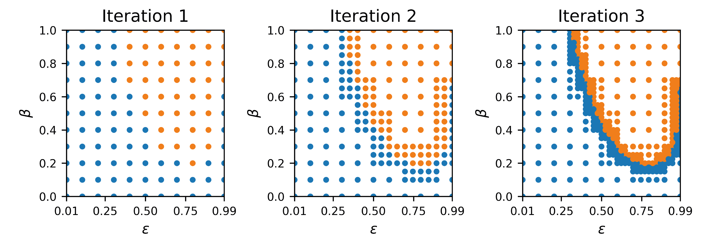

# parameter-space-2d

[![CC BY 4.0][cc-by-shield]][cc-by]

    

Tools for performing 2D parameter space analysis for deterministic models

## Method

Parameter space maps are built up by performing an iterative grid search, preferentially exploring parameter regimes 
close to detected boundaries. Various checks are in place to ensure that any detected boundaries are fully explored.

    

_Example of a model with two states (blue and orange) and variable input parameters β and ε_

## Installation

    pip install parameter-space-2d

## Instructions

The repository contains a series of notebooks with instructions for performing analysis, using the Goehring et al. (2011) PAR polarity model as an example. 

To run in the cloud, click 'launch binder' above.

To run on your local machine, follow these steps:

&#8291;1. Clone the repository:

    git clone https://github.com/tsmbland/parameter-space-2d.git
    cd parameter-space-2d

&#8291;2. Create conda environment:

    conda env create -f environment.yml

&#8291;3. Activate conda environment:

    conda activate parameter-space-2d

&#8291;4. Open jupyter notebooks:

    jupyter notebook scripts/INDEX.ipynb

## License

This work is licensed under a
[Creative Commons Attribution 4.0 International License][cc-by].

[![CC BY 4.0][cc-by-image]][cc-by]

[cc-by]: http://creativecommons.org/licenses/by/4.0/

[cc-by-image]: https://i.creativecommons.org/l/by/4.0/88x31.png

[cc-by-shield]: https://img.shields.io/badge/License-CC%20BY%204.0-lightgrey.svg

